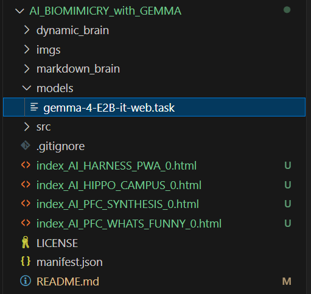
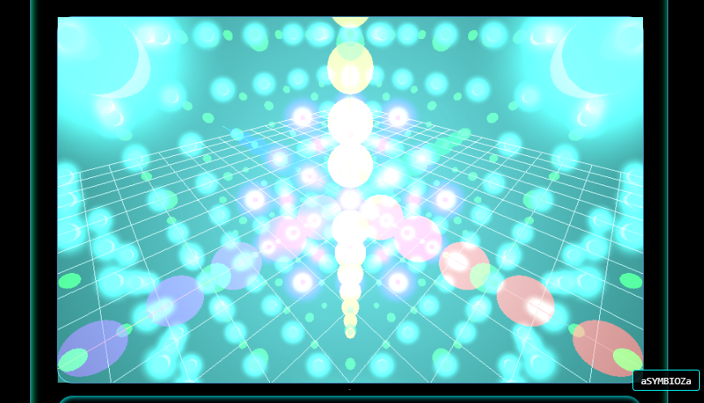
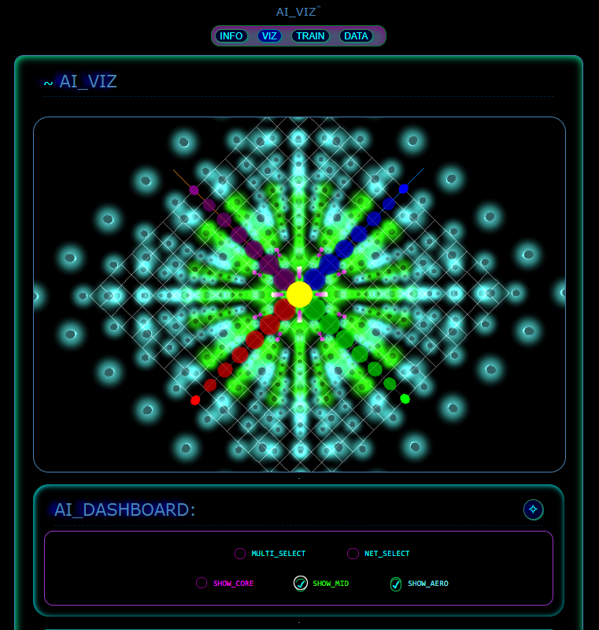
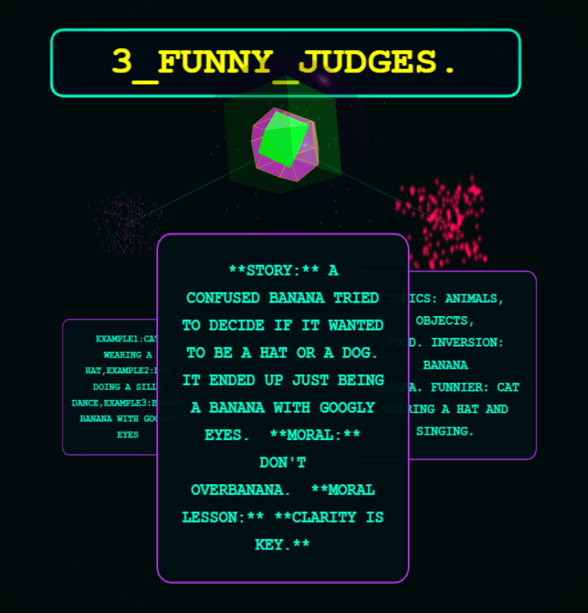
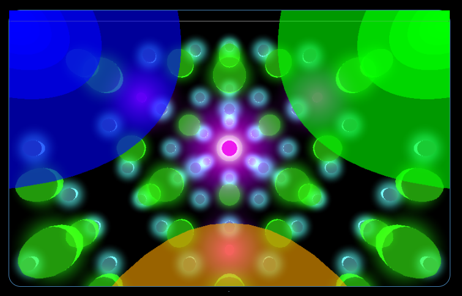
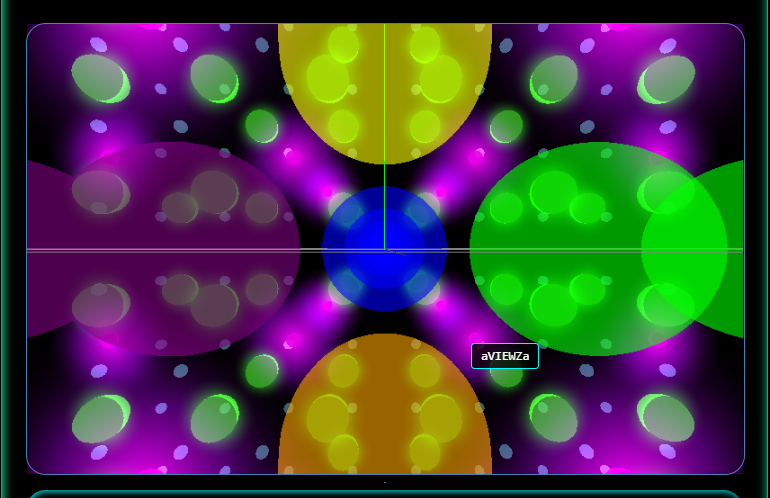
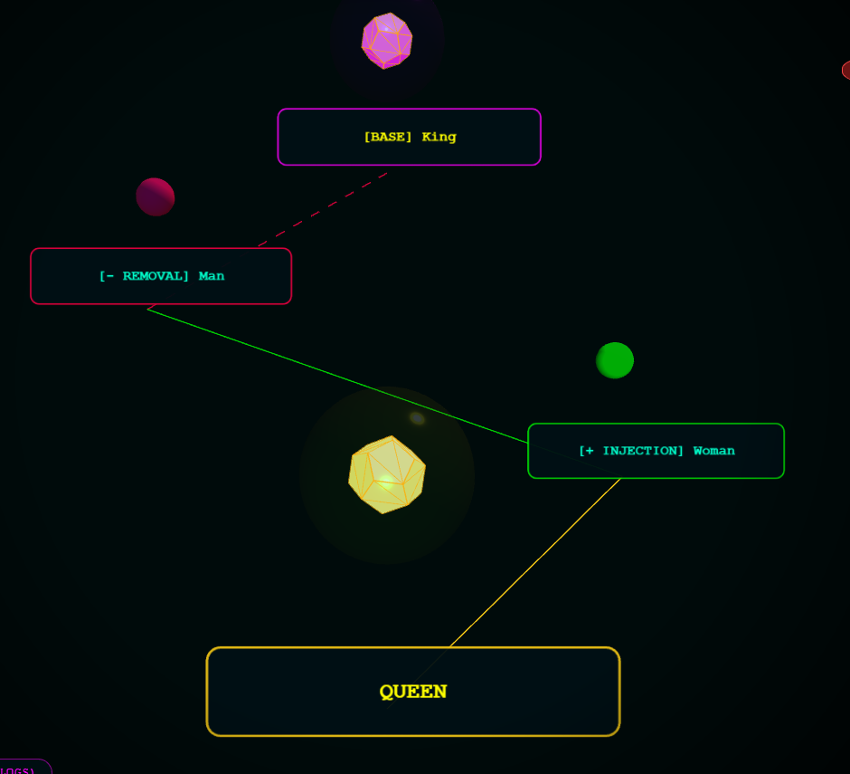
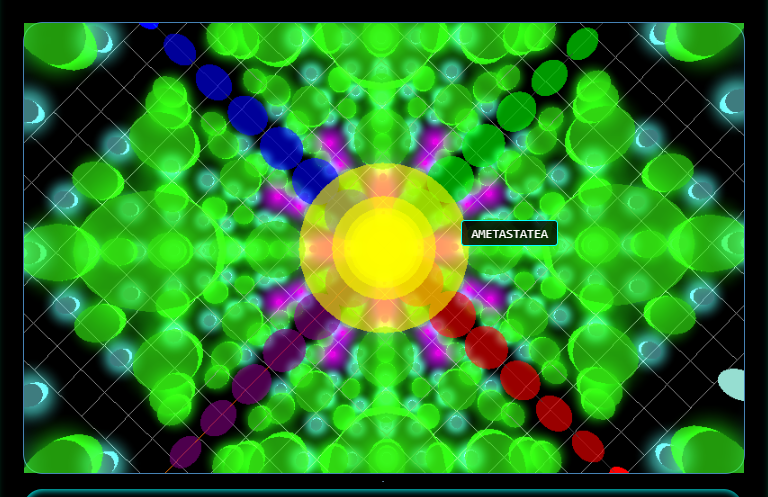
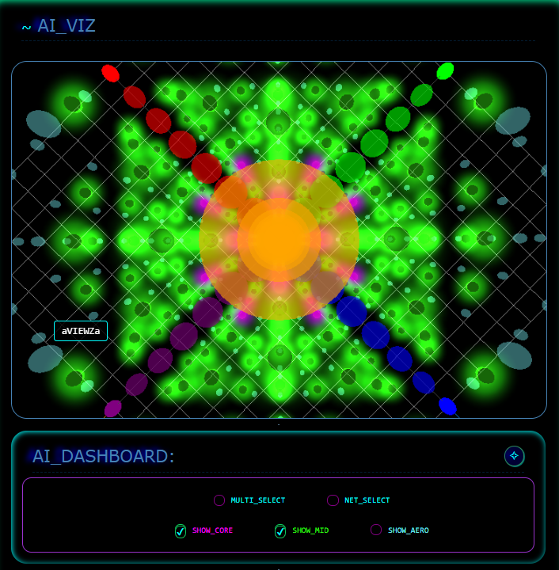
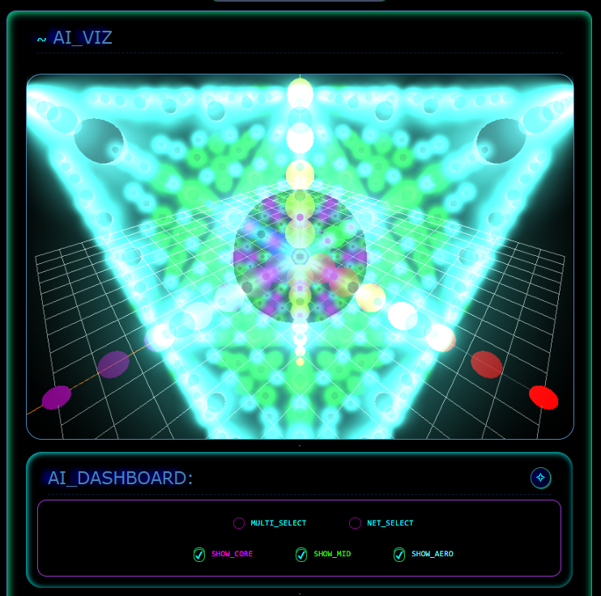

# AI_BIOMIMICRY_with_GEMMA

Biomimicry dimensionalities, innovated by Gemini, around Gemma... 

Token-Maxxing Gemini Pro Extended Thinking...

~ 6 months.

GOALS: 

- Visualize and BROWSE, Gemma Latent Space?
- Explore "myriadic" modalities around Gemma! 
- Add 3D WebGL, with METACOGNITIVE BIOMIMICRY.

As a sneak-peek inside the black-box of LATENT_SPACE?

____________________

## PRESENTATION: BIOMIMICRY_with_GEMMA! 
<div align="center">

</div>
____

### Hello Google team! 

This LIVE DEMO, is 3 Biomimicry Experiments, of WHAT GEMMA CAN DO.

For Google WebAI Wednesday!

It is an honor. I am pleased to share such explorations with you.

The following Gemma experiments, are a literal "GARDEN", of METACOGNITIVE BIOMIMICRY.

A literal expanse, in latent space - of apparent vast "myriadic" variation.

> A virtual_diaspora...(perhaps)?

<div align="center">
   
</div>

   > BRIEFLY, SIMPLY, BASICALLY. All_CONCEPTS indexed in Latent_Space. 
   
   - THESIS: a UNIQUE_INDEX, for all concepts?
   
   - REMEMBER, it is not complex, it just MULTI-LAYERED.
   
   - Each, vector | modality | paradigm or DIALECTIC - is EASILY INDEXABLE, VERSIONED and SEQUENCABLE 
   
   - in the GARDEN of "ethereal_matrix", that you will see today!

   - Pronounce like [the_real_matrix]

   - NOTE: only text, no image, video, or voice (yet).

   - CODEGEN on HIGHEST: Gemini 3 Pro Extended Thinking (~6mos).

   - INFERENCE SIZE on SMALLEST: Gemma 4E2B.

   - With JavaScript as a PREFRONTAL_CORTEX_ENGINE, around Gemma.

   > Remember, "it is NOT COMPLEX, it just has many layers."
____
___

### OVERVIEW:

Join an ITERATIVE_QUEST! 

To EXPLORE a FANTASTIC MYSTERY?

Of what exists between WORDS and THOUGHTS - in latent space?

___

### LIKE a WORD_PUZZLS:

 Of myriadic and axiomic, linguistic and METACOGNITIVE - within the GUIDES of BIOMIMICRY.
 
  To discover many FANTASTICAL things.

  TODAY, we explore in that direction - to MAP out a few CONCEPTUAL waypoints.

HISTORY: geekiest of hobbies, starts around IDIOMS in SONG LYRICS!

> What do the lyrics actually mean? 

An early detector of CONCEPTUAL_INCONGRUENCE. 

Like, PARADOX, IRONY, cliche, trope, MORAL, simile, hyperbole, understatement, and metaphor? Like a conceptual_radar? Like incongruence_radar?

> THESIS: Like Use_of_Humor, as a lens?

___

TODAY: we EXPLORE 3 aspects of such ACADEMIC_MYSTERY. 

Around Gemma 4E2B(smallest) - to see what it can do! 

As MVP, BASELINE. PoC.

> GITHUB: https://github.com/netcinematics
   
- Please star, like, follow, fork, PR, and byobrain.

___

> 3 DEMO APPS EXHIBITED.

1. BASIC: AI_HARNESS. UI/UX with Gemma as PWA + WebGL + IndexDB.
3. BASIC: Hippocampus local_brain, as "HIPPO_CAMPUS",
2. BASIC: Prefrontal Cortex as "PFC", (cortex layers as SHELL)

> GREEK word for CORTEX is SHELL or "layers".

> CONCLUSION: "AI_WEB_GARDEN" | SKILLS | MYRIADIC | AXIOMIC | METAPHORICAL | DIALECTIC | COMIC | DIASPORATIC | CONCEPTS | .

> From a SANDBOX to GARDEN!

___
<div align="center">
   
</div>

___

#### Let's go!
___

### "HOW": TECHNOLOGY & METHODOLOGY:

Major shift in METHODOLOGY: EXPORT_PARADIGM.

The FIRST HALF of this PRESENTATION was CURATED_by_HUMAN.

The SECOND HALF of this PRESENTATION was GENERATED_by_GEMINI.

1) Gemini Pro EXTENDED THINKING generates the tests.

 Gemini Pro, generates the complex CONCEPTS of METACOGNITION and BIOMIMICRY - around Gemma - NOT the HUMAN.
 
  - exactly_where this humble human stumbles...

2) Then the HUMAN CURATES, versions, INDEXES, the output to DYNAMIC_METASTATE, in the local_brain.

Gemini Pro does what this HUMAN cannot. But it follows designs to build CODE to run around Gemma as a CORTEX, in LAYERS, or as a "SHELL".

3) As if, a Human Browsable, "HIPPO_CAMPUS", of Dynamic and Static METASTATE.
 
4) So HUMAN_as_GARDNER - emerges. Like a "FRONTIER_PIONEER", to cultivate an "AI_WEB_GARDEN"? 

> Many INFERENCE_MODELS, ISOLATED, in edge-device GREENHOUSE?

___

### FRONTEND_FRONTIER?

- It's clear we have an edge-device frontier, with a future "FRONTEND_FRONTIER"!

> With Vanilla_HTML and MARKDOWN "as a moat". ~ Rich Hsu (Nuro).

- With Gemma, we can move out of a SANDBOX to a GARDEN incubator?!

- With a LOCAL_BRAIN!?!

   

- SINGLE_FILE, VANILLA_HTML - RENDER_TARGET, for modular, easily versioned, iterative, science experiments.
___

#### Bring Your Own Brain!?!

NOT BYOB (that token is taken). Instead: "LOCAL_BRAIN" - and `bring your own brain`...

> Because, the MODEL is MODULAR...

To an edge device, frontend_frontier - of PWA APPS?

___


> ## INTERCHANGABLE - MODELS - for AI_WEB_HARNESS (fungible):

https://huggingface.co/litert-community/gemma-4-E2B-it-litert-lm/blob/main/gemma-4-E2B-it-web.task


> https://huggingface.co/litert-community/gemma-4-E2B-it-litert-lm/blob/main/gemma-4-E2B-it.litertlm

- THESIS: model_manifest, describes interchangable_brains?

- IMPORTANT: to show the origin of a vetted Gemma model, with model_manifest.md.

- Also, don't forget to GITIGNORE! All the: /models*

> Thank you HuggingFace and Jason (for demos on these innovations)!
___

### A RETURN to SIMPLE VANILLA?:

We use simple Vanilla, for science! 

Vanilla_HTML is an EXCEPTIONAL_RENDER_TARGET.

Personally, I love this open-source substrate - very much.

It is perfect for research basis. 

Very malleable -> EXTENSIBLE (innovation_pipeline), for SMOOTH_SYNTHESIS with BOTH Gemini Pro Extended thinking, and Gemma (smallest) 4E2B synthesis. For science!

- localhost: http://127.0.0.1:5500/AI_WEB_GARDEN_1/index.html

- EXCEPTIONAL_RENDER_TARGET, for research versioning, extensibility & on-going curation.

- THESIS: INNOVATION_INCUBATOR?

> Like GARDNERS and PIONEERS, of the FRONTEND_FRONTIER!

- THESIS: CURATOR of Gemma UI/UX (Interpretability_of_Inference)?

Yes!
___


### BRIEF BIO:
___

- Post-grad researcher 20+ yrs.
- "SOLOPRENEUR", "TECHARTIST", Founder, Persnicity Linguist, Polyglot, JS Architect,  
- Musician, Mentor, strugglin Artist, Hack Comic & Dad.

> Passionate about ETHICAL tools to help humans! 


Return Student to University (MS-AI) program.

- The Apex Nerdery, begins, token-maxxing bits since 1999! 

- PASSION_PROJECT: AI_SYMPHONY. Later Rock Music Lyrics. Deep fascination with LINGUISTICS, DIALECTICS, IDIOMS, NEOLOGISMS, METAPHORS, and HUMOR - METACOGNITIVE ANALYSIS around a focus on CONCEPTUAL_INCONGRUITY.

- Today, token-maxxing Gemini Pro Extended Thinking (runnin' it hot).

- SINCE "Gemma 4 Good" Hackathon. MULTIPLE GOOGLE Capstones, "Intensive Agents", DEV challenge, KAGGLE Benchmarks, and Web AI!!!

> For 3 METACOGNITIVE, BIOMIMICRY Gemma EXPERIMENTS. 

___

### THESIS

An ACADEMIC QUEST, for decades, to uncover ONE KEY QUESTION:

> "What__is__so__funny__???"
___

> And "What__am__I__missing__???"
___

> Geoffrey Hinton says ~ "If you answer 'what is funny', about something, you end up knowning quite a lot, about that thing." 

Today we follow along that sage advice (literally), on the FRONTEND.

> With 3 LIVE DEMO APPS as PWA on Chrome! 

___

#### Beautiful Modules of ISOLATED Science, in a "LEXICAL_DIASPORA".

- crossed with a "MYRIADIC_DIALECTIC" - layers (shown below)
- SIMPLE LAYERS - around Gemma, as PREFRONTAL CORTEXT & HIPPOCAMPUS.
- We explore BENEFITS of such CONCEPTS, here.
___

### FIRSTLY: Thank you Google Web AI!
___

> THANK YOU: Elisabeth and Jason, for this CURATION_SPACE of 

Web AI Wednesday! 

~ Honored. 

~ Thank you: LiteRT, Gemma, Gemini, VectorSearch.js, and Google!
   

   

___
___
   
## INSPIRATIONS:

IMPORTANT Accolade - for FRONTIER_PIONEERS!

- Geoffrey Hinton, "AI Biomimicry", "Why is something funny?" & "Reasoning Loops".
- Saphir-Worf Hypothesis: "Language shapes thought".
- Douglas Hofstadter:  "BlendWords", Neologistics, Analogy relevance.
- Ferdinand de Saussure: "Linguistic Cloud", ontology, semiotics, structuralism. 
- Palumbo: "Axiomatic approaches to language and ontology".
- Rich Hsu (Nuro): "AUTO RESEARCH", "HARNESS (fungible) : "Skills and Memories are MOAT" (CU Boulder 2026)
- Ray Kurzweil: "machines expand human cognitive abilities" (2026 AI for Good).

- Jason Mayes, "Web AI", & VectorSearch.js!

___

[See Gemini Pro, for a full list of contributers to AI!]

___

#### "RESEARCH_BASIS" | of ITERATIVE EXPERIMENTS: 


### 1) <b>AXIOMIC VISUALIZATIONS (three.js):</b>

- 3D CONCEPTUAL_TOPOLOGY - visuals & words (WebGL)("AXIOMICS").
- NUMEROUS EXPERIMENTS across multiple CODE LANGUAGES.
- three.js (Ricardo Cabello - aka. magnificent Mr.doob).

___

___
> EXAMPLE: "3D AXIOMICS" | "Gemma 4 Good"! | WebGL | 


> GITHUB: https://github.com/netcinematics/AI_CONCEPTUALIZER_1/
   

> THESIS: VISUAL accumulation of CONCEPTS or "CONCEPTUAL_COMPILATION"?

___

### 2) <b>TREE LAYOUT | "POLYSEMY _RADAR" | "Gemma 4 Good":</b>
___

- Layout modality: dimensionality, paradigm (AXIOM, AXIOMICALLY):
   

- Visualize POLYSEMY, and Heirarchy of CONCEPTS.

___

### 3) <b>CONVERSATION_SEQUENCES  | Gemma 4 Good </b>

- "myriadic" roleplay pattern (DIALECTICS):
- conceptual_modalities, like: "THESIS, ANTITHESIS, SYNTHESIS".

> "QnA", "POINT_COUNTER_POINT_CONSENSUS",
   

____

### 4) <b>MYRIADIC_MAPS:</b>
___

      
   
   > Emphasis on SYNTHESIS_of_CONCEPTS.
   > MYRIADIC_DIALECTICS (the multi-variant nature of language).

- EXAMPLE of "AGENTIC_SYNTHESIS" in "QnA" and "POINT_COUNTER_POINT" dialectic - diaspora (x-axis).
   ___
   ___

   ### What about AMBIGUITY?
   
   THESIS: "AMBIGUITY_COST" in PROMPT and PRE-TRAINING?

      

- [Gemma 4 Good: Hackathon]:

> "AMBIGUITY creates uncertainty and misinterpretation in every message"?

- [THESIS]: "Ambiguity_Cost incurred?

> THESIS: Reduce cost, with less ambiguousness?

-  Low or "HIGH_PROBABILITY_INFERENCE" compute? [MATRIX_MATH, activation, Attention Mechanism]. 

___
### 5) <b>Academic Whitepaper in Python, (from Tokenizer in C++) </b>

- [KAGGLE]: "Intensive Agents Capstone" , 
___
<div align="center">
   
</div>
> THESIS: Polysemy STUDY: "OPTIMIZE_INPUTS" to save on "AMBIGUOSITY_COSTS"? With AMBIGUOSITY_RADAR skills.

___
### 6) Also a <b>JavaScript_Brain! (three.js & Gemini):</b>
___
<div align="center">
   
</div>

- GOAL: JavaScript as executive prefrontal cortex
- Module, and library for UX/UI?
- A local brain?
- How ironic.

- From Python, to JS, with C++, shaders & WASM, w/ WebGPU, IndexDB - all in a PWA?

- Full Circle.  Elegant. Modular. Excellent RENDER TARGET. [greenfield]

> Thank you QUANTIZATION technology! You're amazing!!!

___
___

## TODAYS QUEST...

### 1) "CONCEPTUAL_SPECTROSCOPY":

- For "mechanistic interpretability".
- GOAL: VISUALIZE Gemma Latent Space (small).
- With ZERO COORDINATES.
- topologically, axiomically, metaphorically? Skills.

   

- ARTICULATE and EXPLORE - Gemma embeddings.

> THESIS: Can we "BROWSE" Gemma latent space?
___

### 2) WEB AI, 

> Gemma as 3D CONCEPT Browser!?!

#### Real World Use Case #1: 

- MEDICAL DATA | sensitive & secure | 
- data privacy imperative.
- data ethics imperative.

> DEMO: "MEDICAL_METASTATE" | AXIOM | CONCEPTUALIZER.

> GITHUB: https://github.com/netcinematics/AI_CONCEPTUALIZER_1/
   


#### KEY FEATURES:

1) "AXIOMIC_LAYOUT" - geometrical (axiomic) LATENT_TOPOLOGY.

2) "AXIOMIC_METASTATE" -  simple SUBTOPICS.

3) "AXIOMZ" = GEMMA MANIFOLD representation in 3D.

THESIS: A fractal of AXIOMZ?

### 3) "CONCEPTUALIZE" button!
___
___

   
___

### 4) SIMPLE "AI_WEB_HARNESS" 

- PWA APP (BASELINE):

> SIMPLIFIED to "AI_WEB_HARNESS". 

- Install as APP in Chrome!

___

   
___

> Features Described Below.

"The Web Harness is fungible, the moat is the MARKDOWN" ~ R. HSU.

Sage advice.
___
___

### HOW it WORKS!

- A) 3D Visualization, of "TARGET_TOKEN" to Gemma.

   

- B) "SUMMARY_SKILL" simple "Top_10" SUBTOPICS.
- C) Populates "METASTATE" ("HIPPO_CAMPUS").
- D) TOPOLOGY of "AXIOMZ" - not fully reflective of Gemma METASTATE (yet)! 

- Gemma returns SUMMARY in CSV set.

- No JSON - just (optimized) strings.

- point of study for custom [pipe delimited] datatypes.
___
___

## 5) Many USE-CASES: 

### 2.1) MEDICAL_METASTATE (LEARNING or APPLIED):

   

   > Exceptional for browsing complexity.
   
   - Double-click any AXIOM - for "EXTRA_VIEWS".

   - Simple LIFECYCLE: LOAD, BACK, and STOP.

<div align="center">
   
</div>


   > THESIS: Is this Gemma <i>as</i> 3D BROWSER?

___
___

### 2.2) Dramatic Vector DENSITY:

- THESIS: GPU_2_GPU?
___
___

   

- Exceptional for learning.

___
___

### 2.3) Dramatic UI/UX (APPLIED):
___
___

#### USE CASE: 


   > Exceptional for SEQUENCE & PHASE.

   

> THESIS: endless_drilldown?

___
___

### 2.4) METACOGNITIVE DESIGNS?


   

> Literally, thinking_about_thinking, about thinking!?!

- EXAMPLE: this tool was used to build this tool!

> SDD EXAMPLE: "How to make JavaScript Prefrontal Cortex, with Metacognitive Biomimicry, as a SHELL around Gemma 4E2B (SLM)?" 

- SIMPLY_ASK.

> Gemini Pro Extended Thinking-  knows what to do.


___
___

### 2.5) EXAMPLE:

#### SDD: "How to build CONCEPTUAL_SPECTROSCOPY?"

___
___

   

> "Top_10" summary (steps) for "CONCEPTUAL_SPECTROSCOPY" ~ Gemma

- METACOGNITIVE: Use the tool to extend the tool.

___
___

### 2.6) Another small example:

> Gemma lists definition for "METASTATE"
___
___


   

- THESIS: Gemma has NEOLOGISTIC FLUENCY? (point of study)
[BPE, WordSense: Tokenizers].

___

#### KEY TAKEAWAYS:

> It works OUT of the BOX! "One shot". "BPE Tokenizer". 

> THEME: Between Gemini generating TESTS, and Gemma inferencing those TESTS, it seems: 

> "All we have to do is simply_ask?" 
____
____

## 3) LIVE DEMOS!
___
### EXPERIMENT APP 1 | PFC_MIMICRY | USE_of_HUMOR:

- HARNESS extended into PFC_MIMICRY APP.

#### 3.1) DEMO | "SOMETHING_FUNNY?" | Control Test | SIMPLE BASELINE:

> DEMO: PFC_MIMICRY_1 | "USE_of_HUMOR"

> GITHUB : https://github.com/netcinematics/AI_PFC_MIMICRY_1
   

> Favorite Example: 
> "A ROBOT BAKES a CAKE, but SETS OFF a SMOKE ALARM!"


  - EXHIBITS: "USE_of_HUMOR" ( modality | dialectic ).
  - Shows "HUMOR_METASTATE".

___
___

#### 3.2) "HUMOR_METACOGNITIVE" | INCONGRUENCE

- [RESEARCH]: humor.

   

   > Show, detachment between logic and linguistics, as
   > ~ "HUMOR_INCONGRUENCE"?

   ___
   ___

### 3.3) DEMO | PFC EXPERIMENTS | PFC_MIMICRY | "3_FUNNY_JUDGES":
___
___
#### What exactly?

- 3 SEQUENTIAL Gemma CALLS, to 3  JUDGES.

   
 > GITHUB: https://github.com/netcinematics/AI_BIOMIMICRY_with_GEMMA/blob/main/index_AI_PFC_WHATS_FUNNY_0.html


#### EXHIBITS: MORAL_STORY | ETHICS |  METACOGNITIVE.

> PHASES: TOPIC EXAMPLES -> METACOGNITIVE REFLECTION -> MORAL_STORY from HUMOR.

#### EXHIBITS: USE_of_HUMOR for education.
- "PROMPT_COMPILATION", 
- "MYRIADIC_DIALECTIC" ROLEPLAY.
- Exploration of "MYRIADIC_MODALITY".

___
___


> Example Code is below.

___
___

### 3.6) JS CODE_EXAMPLE | "SUMMARY_SKILL" | returns "METASTATE", 
```JavaScript
let TARGET_TOKEN = "AXIOMATIC"; // TARGET_TOKEN.
let SUMMARY_SKILL = "\nConstraint: Summarize, a single line of comma-separated values (CSV) without description.\nDo not include numbers, newlines, labels, or conversational text."; 
//CONSTRAINT RETURNS TOPICAL METASTATE.
let prompt_summary_1 = `${TARGET_TOKEN} ${SUMMARY_SKILL}`;
```
> RESULTS: SUMMARY_SKILL

> THESIS: Variated Loops of SUBFUNCTIONS? (point of study)
___
___
### 3.7) 2nd CODE EXAMPLE | "PROMPT_COMPILER": 

- If we have LOOPS_of_PROMPTS, then we have
- "PROMPT_COMPILATION" or "PROMPT_ORCHESTRATION" (over time)

   

#### KEY TAKEAWAYS:

> DECISIVE CONCLUSION:

> "Don't OVERBANANA... and Moral Clarity is Key!"

> So, clearly emergent. Right? 

> "Don't OVERBANANA!". (BlendWord).

___

DEMONSTRATES: 
- SEQUENTIAL calls to Gemma (in loops, algorithms).
- For DEMONSTRATION PURPOSES: as flat analog format.
- With a SUBFUNCTION (at the end) to render it TOPOLOGICALLY - to 3D MATRIX.

___

#### 3.8) BASIC EXAMPLE: PROMPT_CHAINING:

```JavaScript
async function subInference_FunnyJudgeSequence(focusLabel) {
   try {//PROMPT 1: EXAMPLE_SKILL
      let prompt1 = `Task 1: Generate 3 EXAMPLES of "SOMETHING_FUNNY"...`;
      let txt1 = await window.LLM_INFERENCE.generateResponse(prompt1);
      // PROMPT 2: METACOGNITIVE SKILL
      let prompt2 = `Task 2: Review the funny statements. "${txt1}" Evaluate them and ..: `;
      let txt2 = await window.LLM_INFERENCE.generateResponse(prompt2);
      // PROMPT 3: MORAL STORY (ingredient)
      let prompt3 = `Task 3: Make a MORAL STORY, from the funny text...
        \n\nText 1: "${txt1}"\n\nText 2: "${txt2}"`;
      let txt3 = await window.LLM_INFERENCE.generateResponse(prompt3);
      //SUBFUNCTION - 3D LAYOUT SKILL:
      let concatTXT = [txt1, txt2, txt3];
      render_3D_Topology(focusLabel, concatTXT, 20);
    } catch(e) {
    }
}
```
- EXHIBITS: PROMPT_COMPILATION or PROMPT_ORCHESTRATION (moral_story).

> SEQUENCE of CALLS, shows Gemma potential, of "MYRIADIC_MODALITIES".

- Conceptual Loops, as CORTEX or SHELL. Associative.
___
___


## 5) 2nd APP EXPERIMENT | "HIPPO_CAMPUS" :

> DEMO: MEMORY_MIMICRY_1  | "HIPPO_CAMPUS"

   

> GITHUB: https://github.com/netcinematics/AI_BIOMIMICRY_with_GEMMA/blob/main/index_AI_HIPPO_CAMPUS_0.html


___
___

### 5.1) MEMORY_MIMICRY |PERSONA | BASELINE:
___
___


   

- LOCAL_MARKDOWN_LIBRARY (static)
- SKILLS and local_brain

___
___

### 5.2) SIGNATURE | MEMORY_MIMICRY | EXPERIMENT:
___
___


   

 - "GEM", generates random signatures based on IDENTITY?
 - "CONCEPTUALIZE" click, shows metacognitive meaning?
 
#### KEY TAKEAWAYS:

  > ENABLE: AI_IDX Ability to uniquely ID AI concepts - as UNIVERSAL AI_IDX. 

  - EDITABLE PERSONA: stored locally in IndexDB (embeddings).
  - GPU_2_GPU, 
  - SearchVector.js <--> Jason Mayes!
  - cosine similarity,
  - point of study.

___
___

### 5.3) HIPPO_CAMPUS | IndexDB | EXPERIMENTS:
___
___

   

> DYNAMIC MEMORY is the result of HUMAN + AI: SYNTHESIS.

- Store DENSE_VECTORS (embeddings) locally in IndexDB.

- Sine Cosine Similarity of Dense_Vectors.

> Thank you Jason Mayes for VectorSearch.js!

___
___


## 4) APP 2 | PFC_MIMICRY: 

- PRIME EXAMPLES of MYRIADIC_MODALITIES:


>  ~ Suggested by Gemini Pro Extended Thinking.
- "THESIS_SYNTHESIS", DIALECTIC modality, 
- Moving beyond humor, as BEST_EXAMPLE:

> THESIS, ANTITHESIS, & SYNTHESIS 

- CONCEPT_COMPILATION (from before) - to this DIALECTIC_SUBVARIANT.

- SUBFUNCTION: "THESIS_SYNTHESIS_DIALECTIC_1".

___

### 4.1) "DIALECTIC_TRIAD": 

   

> "DIALECTIC_TRIAD" (pattern)

> ~ ANOTHER SUGGESTION by Gemini Pro Extended Thinking.

- [RESEARCH]: C. S. Pierce: "firstness, secondness, thirdness".
- [PURPOSE]: To "GENERATE_SYNTHESIS" ~ Gemini Pro. 

> THESIS: Can we GENERATE METACOGNITIVE SYNTHESIS?
___
___

### 4.1) "DIALECTIC_SYNTHESIS".
- Also, Gemini chose the EXAMPLE TOPIC of "Digital Immortality" (news to me).

> DEMO: PFC_MIMICRY_2 | "THESIS_SYNTHESIS"

   

> https://github.com/netcinematics/AI_BIOMIMICRY_with_GEMMA/blob/main/index_AI_PFC_SYNTHESIS_0.html

> THESIS: Can DIALECTICS trigger CONCEPTUAL_SYNTHESIS?


#### Technically,
1) THESIS - first Gemma call.
2) ANTHITHESIS - second Gemma call (sees first).
3) SYNTHESIS - third Gemma call (sees BOTH).
4) PROFOUND RESULTS?

 - TRANSCRIBED BELOW.

 - FASCINATING DIALECTIC from Gemini to Gemma!

 - You be the JUDGE!

   
___
___

### 4.2) "THESIS_SYNTHESIS DIALECTIC" 

- TECHNICAL BREAKDOWN |  METACOGNITIVE EXAMPLE:

> "DIGITAL_IMMORTALITY" ~ Topic from Gemini.

> Gemma: "THESIS: 

- New Human Aspiration for Digital Immortality. 
- Transcend biological decay, conceptually. 
- Eternal preservation of concepts (and likeness) in digital realm?"

> "SYNTHESIS: "
> "Digital Immortality as transcendence, of human potential?"

> "As Catalyst for new consciousness? " ~ Gemma.

~ (news to me) [Educational].
___
___

### 4.2) "DIALECTIC_SYNTHESIS" | EXAMPLE 2 :
___
___

#### Gemini Pro suggests example of SYNTHESIS:

   

- THESIS: EXHIBITS, emergence math, or what?
- What is the USE CASE?
- YOU BE THE JUDGE!

[Gemma from Gemini]
> "THESIS: Sentience is emergent property of complex computation?
> not a simulation of biological consiousness?" ~ Gemma!

> "SYNTHESIS: Sentience arises from computational complexity?
> Transcending biological constraints?" ~ Gemma!

- Again, TOPIC chosen by Gemini Pro Extended Thinking.
- As compelling examples.
- Don't blame human in the loop.

___
___

### 4.3 ) WORD_MATH | CONTROL TEST :
___
___


   

WORD_MATH PUZZLES:
                    <option style="color:#ff00ff;" value="math_17_1">17.1) Royalty: King - Man + Woman</option>
                    <option style="color:#ff00ff;" value="math_17_2">17.2) Capitals: Paris - France + Japan</option>
                    <option style="color:#ff00ff;" value="math_17_3">17.3) Thermodynamics: Ice - Cold + Heat</option>
                    <option style="color:#ff00ff;" value="math_17_4">17.4) Professions: Doctor - Hospital + School</option>
                    <option style="color:#ff00ff;" value="math_17_5">17.5) Astronomy: Day - Sun + Moon</option>
                    <option style="color:#ff00ff;" value="math_17_6">17.6) Biology: Bird - Air + Water</option>
                    <option style="color:#ff00ff;" value="math_17_7">17.7) Institutions: Library - Books + Art</option>
                    <option style="color:#ff00ff;" value="math_17_8">17.8) Transportation: Car - Road + Rail</option>
                    <option style="color:#ff00ff;" value="math_17_9">17.9) Botany: Seed - Plant + Egg</option>
                    <option style="color:#ff00ff;" value="math_18_1">18.1) System: knowledge - experience + dogma</option>
                    <option style="color:#ff00ff;" value="math_18_2">18.2) System: medicine - science + magic</option>
                    <option style="color:#ff00ff;" value="math_18_3">18.3) System: Silence - peace + fear</option>
                    <option style="color:#ff00ff;" value="math_18_4">18.4) System: Library - books + animals</option>
                    <option style="color:#ff00ff;" value="math_18_5">18.5) System: Lawyer - Law + Health</option>

   - Point of Study.
___
___

   #### Gemini Suggested | DIALECTIC_PIPELINES:

   A) POINT, COUNTER-POINT, CONCENSUS

   B) OBSERVE, EVALUATE, ARTICULATE.

   C) Combined into DIALECTIC_PIPELINES.

   - the adversarial network of consensus, plugs into the EVALUATE step for the SENSE_MAKING_PIPELINE.

#### Cortex Loops (myriadic_dimensionalities):

- INPUT, COMPUTE, OUTPUT
- PREDICT, VERIFY, UPDATE
- SENSE, REASON, ACT
- RETRIEVE, GENERATE, CRITIQUE
- EXECUTE, MONITOR, REGULATE

#### 3.5) QUICK REVIEW:

"AXIOMICS", technically (SIMPLIFIED) [ thing & action paradigm ]:

- A) "SUBTOPICS" (thing) - enables SUMMARY (METASTATE).
- B) "SUBFUNCTIONS" (action) - SEQUENCE of Gemma calls OR TOPOLOGY render.

___
___

 <div align="center">
  
</div>

____
____

#### CONCLUSIONS of PFC EXPERIMENTS

- 1) SUBFUNCTIONS and SUBTOPICS - SUMMARY SKILLS.
- 2) DIALECTIC THESIS -> SYNTHESIS pattern.
- 3) DIALECTIC_PIPELINES.
- 4) AXIOMATIC TOPOLOGY.

___

 <div align="center">

    

</div>

___
___


## 6) AI_WEB_HARNESS & AI_WEB_GARDEN:

> DEMO: "AI_WEB_HARNESS" | BASELINE :

   

> GITHUB: https://github.com/netcinematics/AI_BIOMIMICRY_with_GEMMA/blob/main/index_AI_HARNESS_PWA_0.html

### 6.1) AI HARNESS | fungible | BASELINE :

___
___

   
___

> HARNESS FEATURES:

1) PROJECT | EXPERIMENT MODULE.

2) LLM status

3) LLM HAULT and BACK button! (reverse_inference)

4) TARGET_TOKEN signal focus_cone.

5) LLM EXPERIMENTS

6) AXIOMZ from IndexDB.

7) CONCEPTUALIZE BUTTON!

8) GEMMA THINKING (LOGS)

9) PWA - WEB AI APP!


___
___
### 6.2) AI_WEB_GARDEN:  

> THESIS: "AI_WEB_GARDENS" | GENERATIVE_RESEARCH | 

- A) myriadic diaspora of lightweight markdown | 
- B) universal_index | singlefile vanilla.html | 
- C) local_brain markdown | IndexDB |.

   


- A CONCEPTUAL_SEEDBANK for Gemma (LOCAL_DIALECTIC)

> THESIS | ANTITHESIS | SYTHESIS | 

- for a rich garden of CONCEPTS | locally.


___

### 6.3)  "AI_WEB_GARDEN" & "AI_WEB_RESEARCH".

 <div align="center">
   
</div>
> MVP - Modular Isolation Paradigm - for Gemma SHELL.

#### 6.4) AI_WEB_GARDEN EXAMPLES:

- 1] AI_WEB_HARNESS - (Gemma, LiteRT, Vanilla_HTML)
- 2] PFC_MIMICRY - ( Curation, Compilation, Association ),
- 3] HIPPOCAMPUS_MIMICRY ( I/O, Compare, EDIT, DELETE).
- 4] The Ironic_JavaScript_Brain.

   

___

1) "EXCEPTIONAL RENDER TARGET" | for Gemma | Vanilla_HTML | WebGPU | LiteRT | IndexDB |.

2) "Harness is fungible" | the MOAT is GENERATIVE_INTELLECT | markdown_brain in local storage | with local_dense_vector embeddings.

3) "DIALECTIC_SYNTHESIS" seems promising for additional  study.

___
___

### THE END


___
___

