# AI_BIOMIMICRY_with_GEMMA

Biomimicry dimensionalities, innovated by Gemini Pro Extended thinking, around Gemma 4E2B (SLM).

> With 3D WebGL portal into Gemma Matrix! 

GOAL: Visualize and BROWSE Latent Space?

>  Explore emergent modalities. 

____________________

## PRESENTATION: BIOMIMICRY_with_GEMMA: 

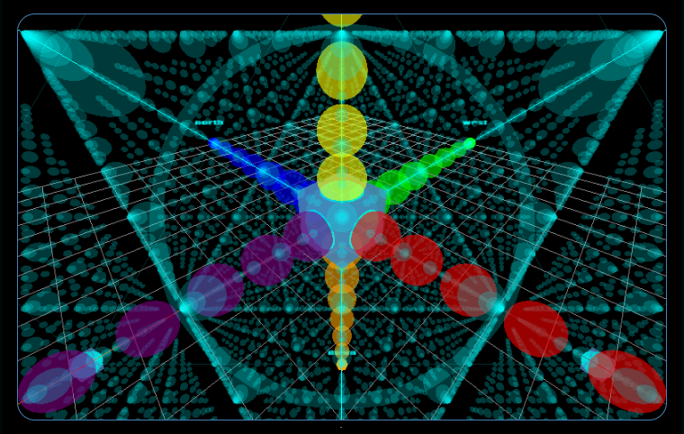

____

### Hello Google team! 

This LIVE DEMO is Biomimicry Experiments, for Google WebAI Wednesday with Gemma!

It is an honor to be here.
The following, is a literal "garden", of BIOMIMICRY EXPERIMENTS.

   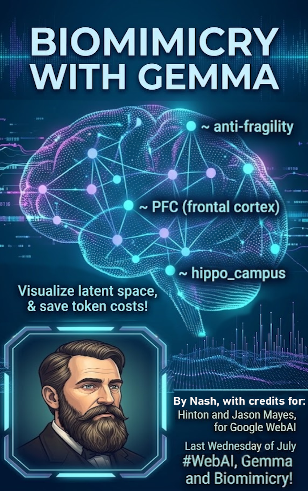

____
___

### BASIC OVERVIEW:

An ITERATIVE_QUEST, around BIOMIMICRY and METACOGNITION.

TODAY, we EXPLORE 3 aspects of that ACADEMIC_MYSTERY, around Gemma!

> GITHUB: https://github.com/netcinematics
   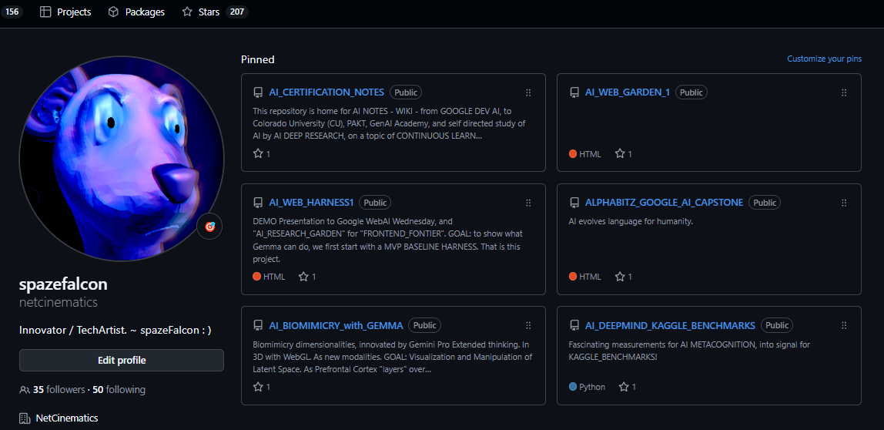


> 3 DEMO APPS (with help from Gemini Pro Extended Thinking).

1. BASIC: AI_HARNESS, with Gemma as "AI_WEB_HARNESS" (PWA - APP).
2. BASIC: Prefrontal Cortex as "PFC_SUBFUNCTIONS",
3. BASIC: Hippocampus local memory, as "HIPPO_CAMPUS",

> CONCLUSION: Axiomic and myriadic: "AI_WEB_GARDEN" diaspora (metaphor).

Let's go!
___

### "HOW": TECHNOLOGY & METHODOLOGY:

Today, how we use Gemini Pro + to Generate (concepts) of a LOCAL_BRAIN for Gemma. With 1 HUMAN in the loop, as CURATOR, to cultivate, an "AI_Web_Garden", of ISOLATED_INFERENCE_MODELS.

> With HTML and MARKDOWN, FROM SANDBOX to GARDEN!

   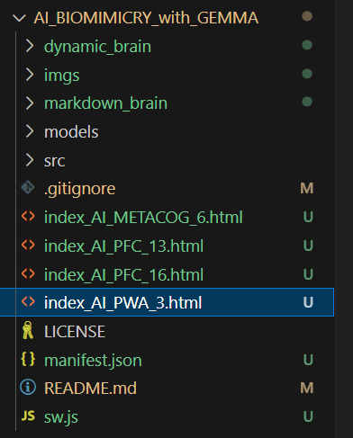

- PWA and localhost: http://127.0.0.1:5500/AI_WEB_GARDEN_1/index.html
- EXCEPTIONAL RENDERING TARGET for research versioning (extensibility).

> Like gardeners and PIONEERS, on the FRONTEND_FRONTIER!

___

### BRIEF BIO:
___

University student (AI-MS) | "SOLOPRENEUR" | Founder | AI Researcher | Architect | Musician | Comic | Father and Artist.

> Passionate about ETHICAL tools to help humans! 


- Apex nerdery, token-maxxing vectors since 1999! 

- Today, AI_RESEARCH on BIOMIMICRY & METACOGNITION. 

___

### THESIS

For 2 decades, a serious quest for ANSWERS. To deep questions, like:

> "What is so funny???"
___
   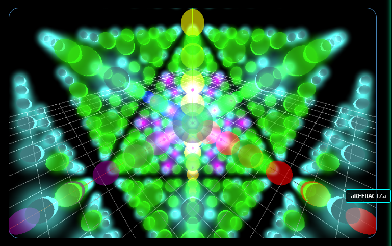
___

> "If you answer 'what is funny', about something, you end up knowning quite a lot, about that thing." Geoffrey Hinton.

Today, we (literally) follow that sage advice.


> With 3 LIVE DEMO - PWA APPS.
___

### Thank you Google Web AI!
___

> THANK YOU: Elisabeth and Jason, for this learning space. 

~ LiteRT, Gemma, Gemini, and Google!
   

____

## INSPIRATIONS:

Deep gratitude to FRONTIER_PIONEERS!

- Geoffrey Hinton, "AI Biomimicry", "Why is something funny?" & "Reasoning Loops", "Back Propagation".
- Saphir-Worf Hypothesis: "Language shapes thought".
- Douglas Hofstadter:  "BlendWords", Neologistics, Analogy relevance.
- Ferdinand de Saussure: "Linguistic Cloud", ontology, semiotics, structuralism. 
- Palumbo: "Axiomatic approaches to language and ontology".
- Rich Hsu (Nuro): "AUTO RESEARCH", "HARNESS (fungible) : "Skills and Memories are MOAT" (CU Boulder 2026)
- Ray Kurzweil: "machines expand human cognitive abilities"

- Jason Mayes, "Web AI", & VectorSearch.js!

___


#### EXAMPLES of  "RESEARCH_BASIS", HISTORY: 

> "CONCEPTUAL_AXIOMICS" 

- NUMEROUS EXPERIMENTS in multiple CODE LANGUAGES.
- 3D CONCEPTUAL_TOPOLOGY - visuals & words.

___

1) <b>AXIOMIC VISUALIZATIONS (three.js):</b>
___
   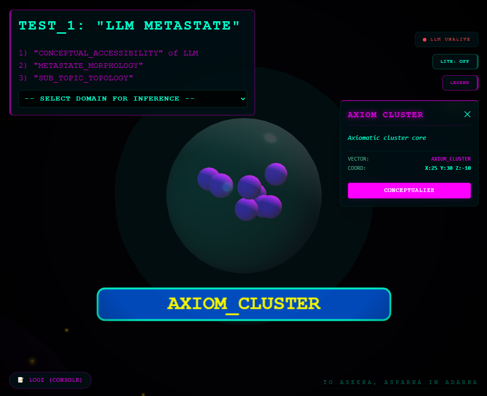

> VISUAL accumulation of CONCEPTS?
___

2) <b>TREE LAYOUT:</b>
___
   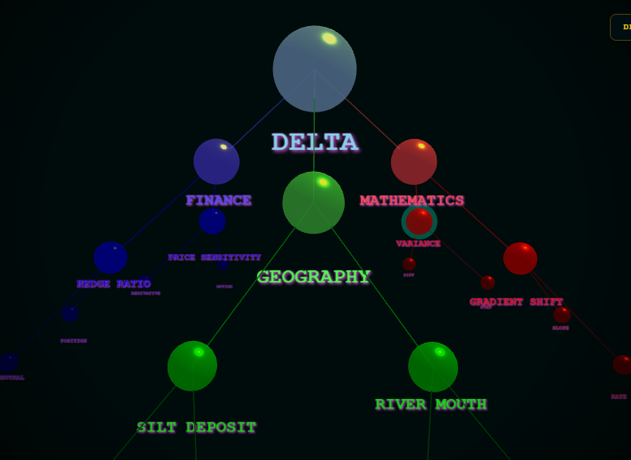

- Visualized Heirachy of CONCEPTS (polysemy & hyponymy).

> ~ With Gemma 4 E2B, LiteRT, and Gemini Pro Extended Thinking. 
___

3) <b>CONVERSATIONAL INTERACTION SEQUENCES :

- "myriadic" conversation patterns
- conceptual_modalities: "QnA", "THESIS_SYNTHESIS" etc)</b>
___
   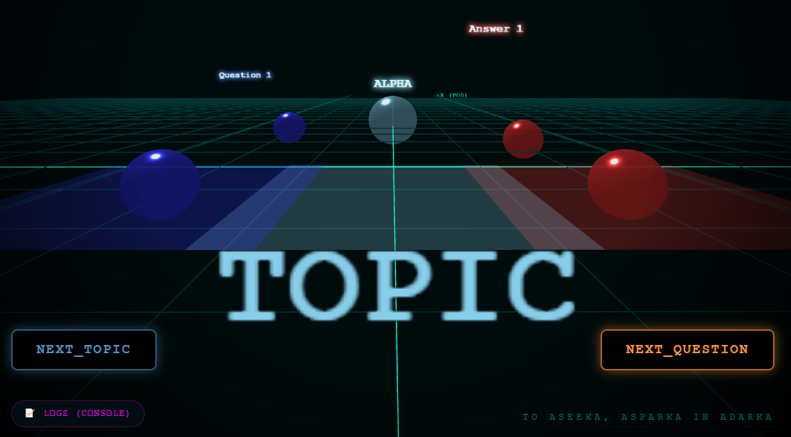

____

4) <b>MYRIADIC_MAPS:</b>
___

   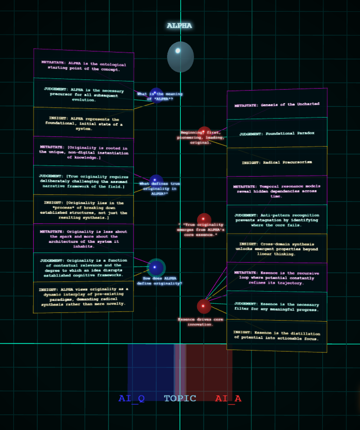   
   
   > INFINITE_DIALECTICS (a myriadic nature of language).

   ___
   ___

   ### What about AMBIGUITY?
   
   REMINDER: Ambiguity_Cost within Attention Mechanism to calcualate probability of CONTEXT.

   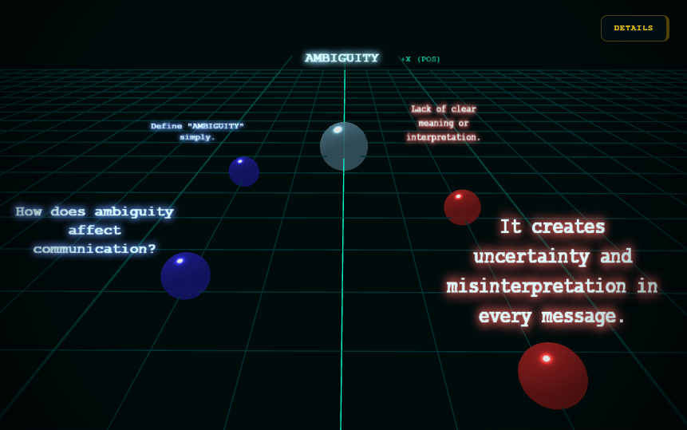   

- "AMBIGUITY creates uncertainty and misinterpretation in every message".
- [HUMAN]: Ambiguity creates confusion in every message?
[THESIS]: "Ambiguity_Cost incurred, by every ambiguity, no matter how slight - in multi-head perceptron and attention mechanism logic calculation, and activation mechanism.

___
5) <b>Academic Whitepaper in Python, (Tokenizer in C++)</b>
___

   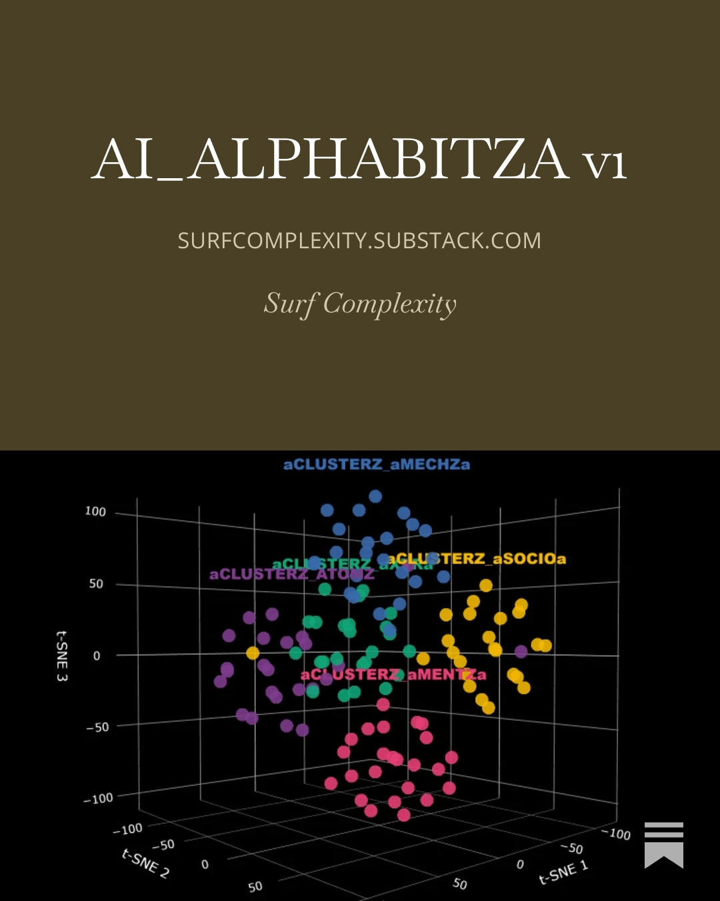

> "OPTIMIZE_INPUTS" to save on "AMBIGUOSITY_COSTS".
___
6) <b>JavaScript_Brain (three.js):</b>
___

   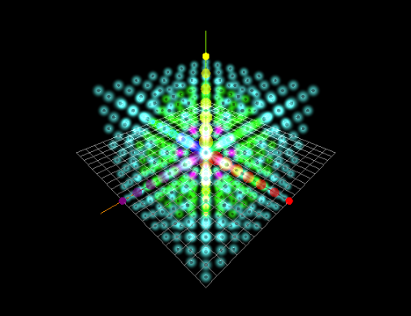

- Python, creates JavaScript - to run C++ shaders on WASM?!?

> Ironic. Once again - we complete a full circle?!?
___

## TODAYS QUEST:

### 1) CONCEPTUAL_SPECTROSCOPY! 

- for "mechanistic interpretability".

   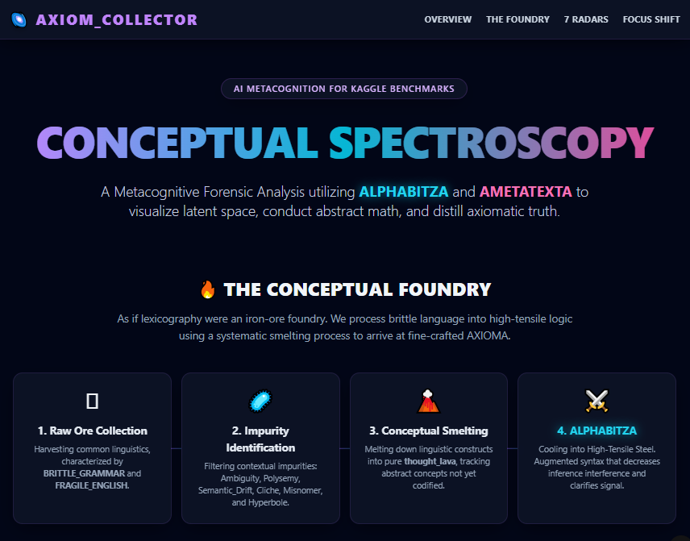

- Visualize latent space CONCEPTUALLY.

- But also ARTICULATE and EXPLORE - Gemma Latent Space.

> "BROWSE" Gemma latent space?
___

### 2) AI WEB -> 3D Gemma as Browser!?

- PII MEDICAL DATA | sensitive | data privacy_imperative.

   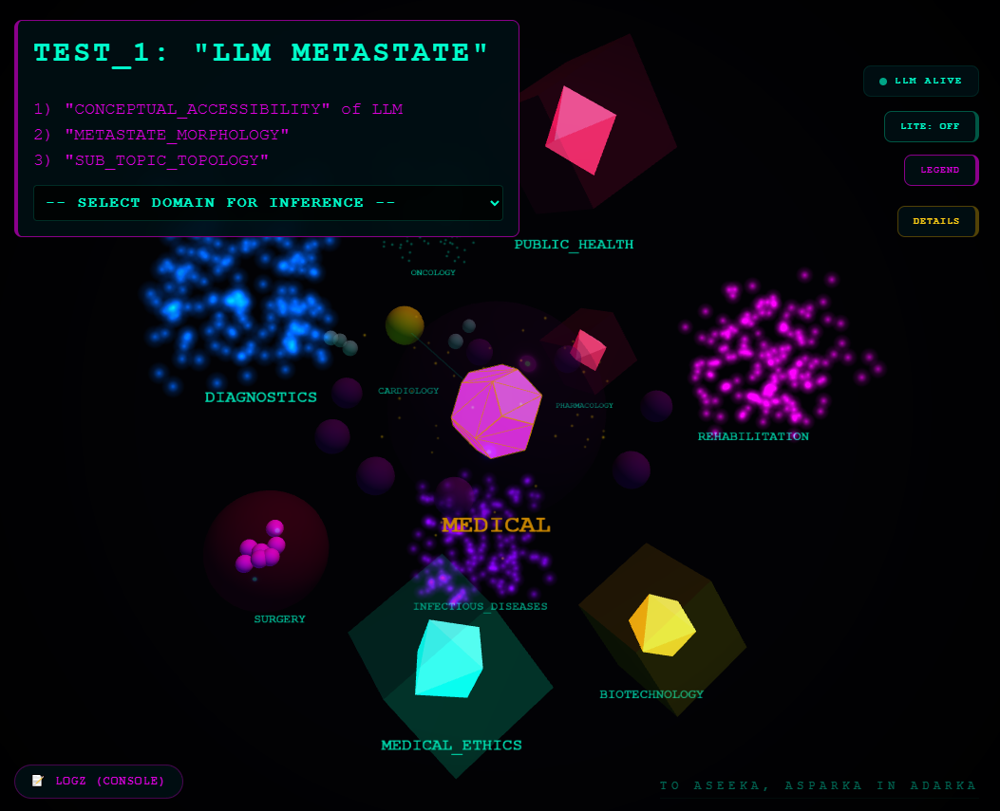

1) "AXIOMIC_LAYOUT" - geometrically axiomic.

2) "AXIOMZ" - MANIFOLD representation of (text) VECTORS.

3) "AXIOMIC_METASTATE" -  SIMPLE subtopics & subfunctions.

> SIMPLIFIED: down to "AI_WEB_HARNESS".

"The Web Harness is fungible, the moat is the MARKDOWN" ~ R. HSU.

___
___

### 3) AI_WEB_HARNESS - HOW it WORKS!

- A) 3D Visualization, of "TARGET_TOKEN" to Gemma.

   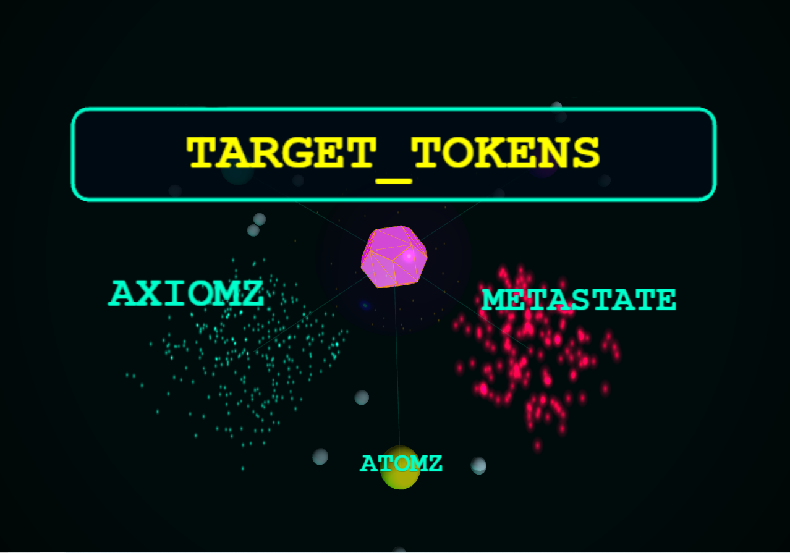

- B) "SUMMARY_AGENT" simple SUBTOPICS.
- C) Inturn, populates "METASTATE" ("HIPPO_CAMPUS").
- D) TOPOLOGY of "AXIOMZ" - starting points like vectors. 
- E) WebGL | C++ Shaders (innovation point).

___
___

### 4) "CONCEPTUALIZE" button!
___
___

   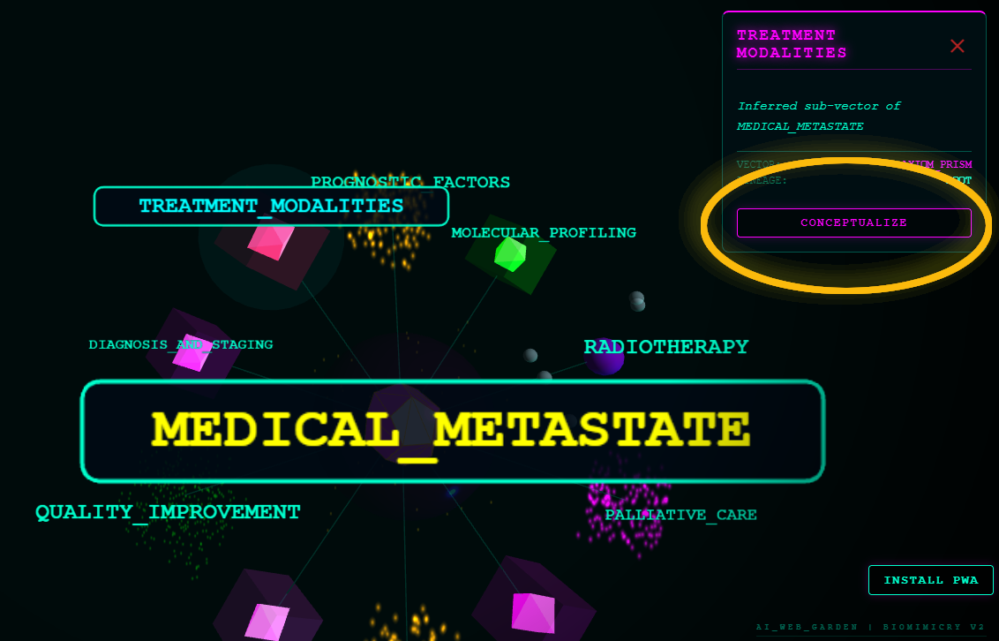

> Gemma is asked to return a SUMMARY in CSV set.
___
___

## 2) Many USE-CASES: 


___
___

### 2.1) MEDICAL_METASTATE (APPLIED):

   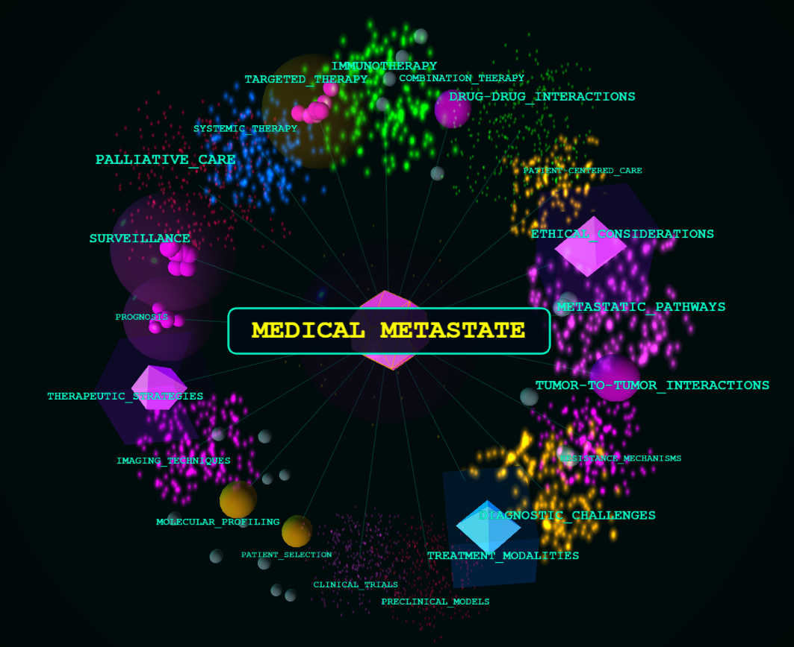

   > Exceptional for browsing complexity.
   
   - Just double-click any node - for extra views.
   - Then: LOAD, BACK, and STOP (lifecycle).
   
   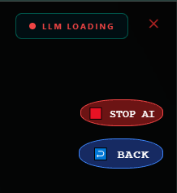

   > THESIS: NOT Gemma <i>in</i> Browser - but Gemma <i>as</i> BROWSER???

___
___

### 2.2) Dramatic Vector DENSITY:
___
___

   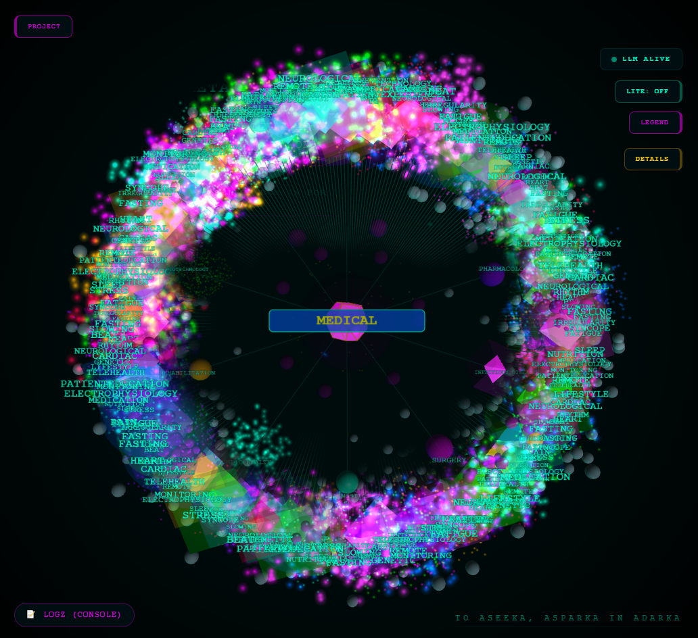

- Exceptional for learning.

> FAST, and it didn't crash! 
___
___

### 2.3) Dramatic APPLIED UI/UX:
___
___

#### BASIC DEMO 

- "AXIOMICS" (AI science) for "CONCEPTUAL_SPECTROSCOPY":
___

   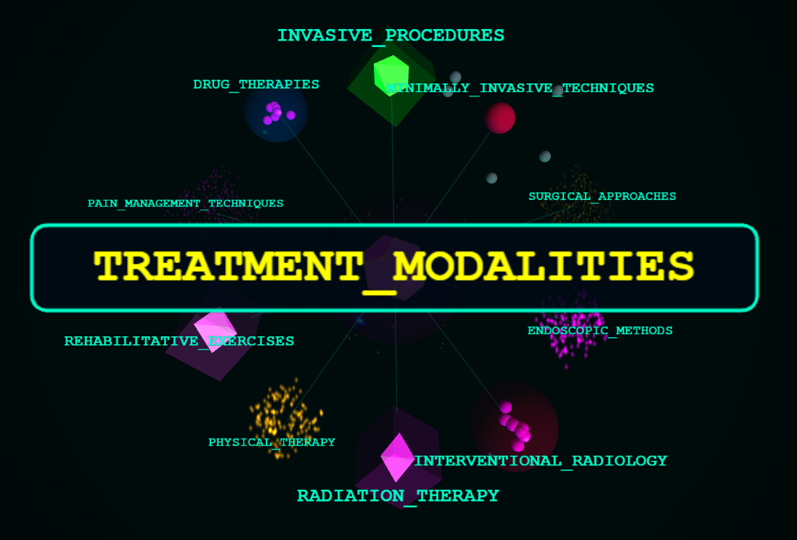

> Extra_Ability: of endless_drilldown?

___
___

### 2.4) METACOGNITIVE_ABILITY:


   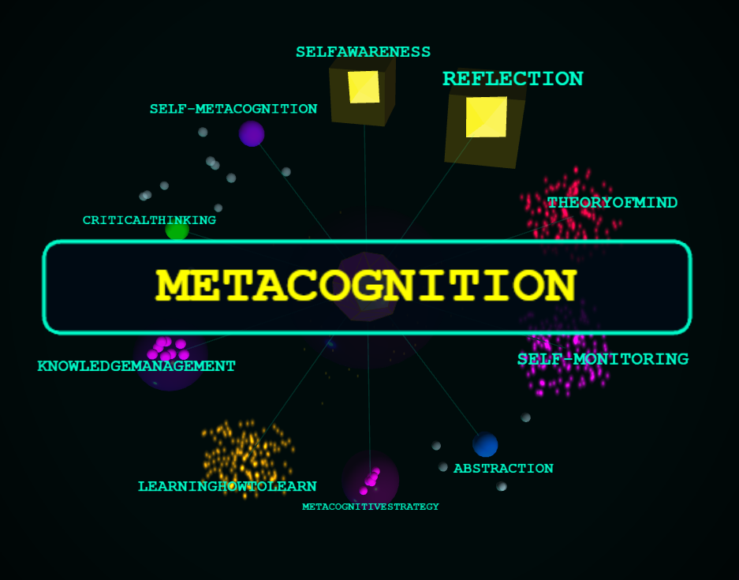

> Literally, thinking_about_thinking?

- The tool was used to metacognitively study the concept of the tool 
- to extend biomimicry research in the tool.

>  PRINCIPLE: CONCEPTUAL_INCEPTION through ITERATIVE_SYNTHESIS?
___
___

### 2.5) EXAMPLE:

#### CONCEPTUAL_SPECTROSCOPY (project):

___
___

   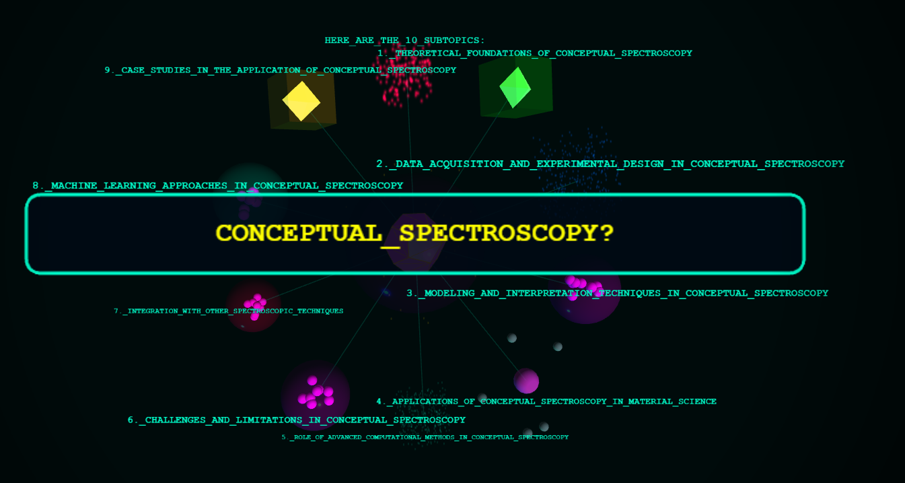

> SHOWS PLANNING STEPS - as INCEPTION loop.

- Using the tool to extend the tool.
___
___

### 2.6) Another small example:

"METASTATE" - NEOLOGISTICS:

> Gemma basically lists what is needed for "METASTATE"
___
___


   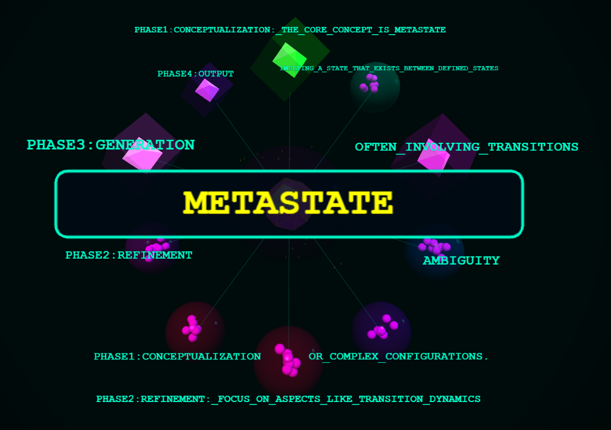

- PROOF: Gemma (E2B), has FLUENCY with NEOLOGISTICS? (innovation point).

> THEME: "All we have to do is ask it?" (Gemma)
____
____

## 3) LIVE DEMOS!
___
### EXPERIMENT APP 1 | PFC_MIMICRY | USE_of_HUMOR:

- HARNESS extended into PFC_MIMICRY APP.

#### 3.1) DEMO | "SOMETHING_FUNNY?" | Control Test | SIMPLE BASELINE:

   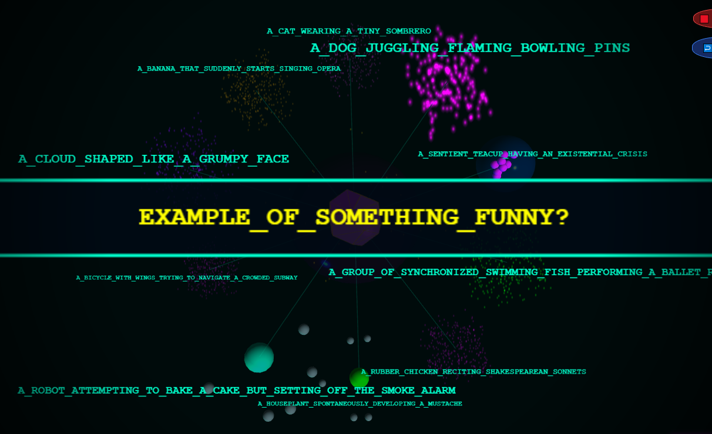

> Hilarious Example: 
> "ROBOT BAKES a CAKE, but SETS OFF a SMOKE ALARM!"

 

  - EXHIBITS: "USE_of_HUMOR" | modality |.
  - Shows "HUMOR_METASTATE".

___
___

#### 3.2) "HUMOR_METASTATE" 

- use tool to research humor.

   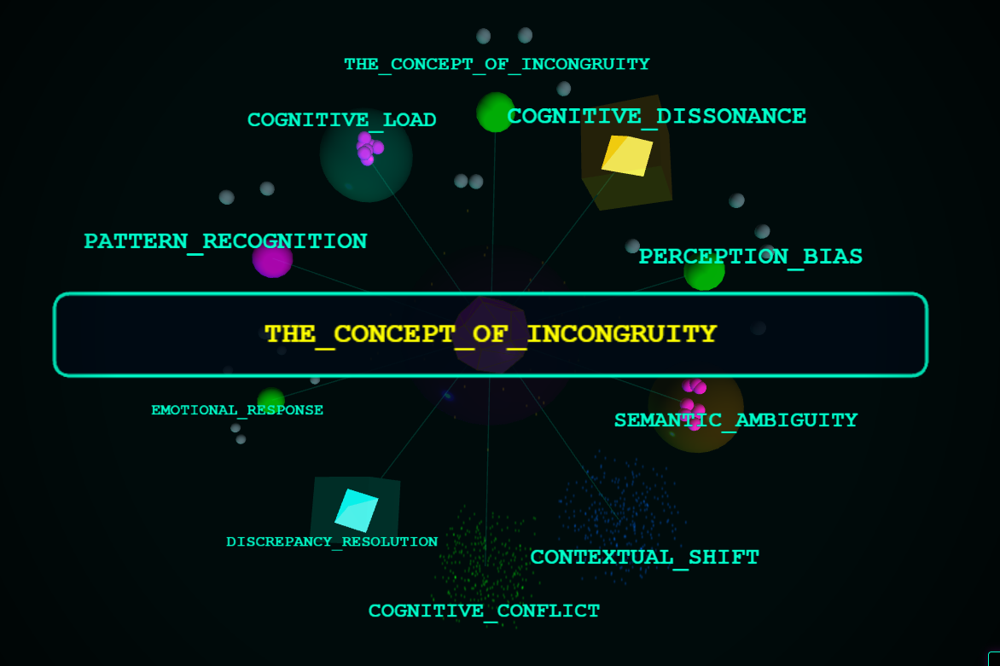

   > Show, detachment between logic and 
   > ~ "HUMOR_METACOGNITIVE"?

   ___
   ___

### 1.2) DEMO | PFC EXPERIMENTS | PFC_MIMICRY | "3_FUNNY_JUDGES":

- Gemma FRONTEND SKILLS

___
___
### 1.3) What exactly?
   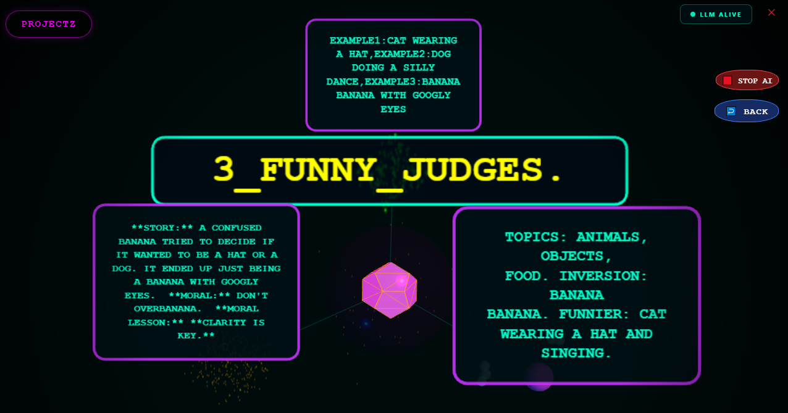

- 3 SEQUENTIAL Gemma CALLS, to 3  JUDGES.

> DECISIVE CONCLUSION: "Don't OVERBANANA, and Clarity is Key!"

#### EXHIBITS: MORAL_STORY | ETHICS |  METACOGNITIVE.

> PHASES: TOPIC EXAMPLES -> METACOGNITIVE REFLECTION -> MORAL_STORY from HUMOR.

#### EXHIBITS: USE_of_HUMOR for education.
- "PROMPT_COMPILATION", of 
- "MYRIADIC" ROLEPLAY.


___
___

#### 1.4) "AXIOMICS", technically (SIMPLIFIED):
- "SUBTOPICS" (thing) - enables SUMMARY (METASTATE).
- "SUBFUNCTIONS" (action) - sequence of Gemma calls.

___
___


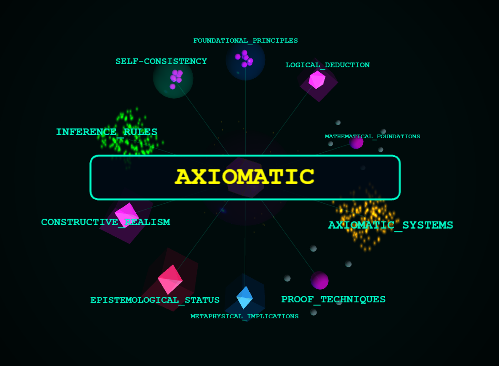

> Example Code is below.
___
___

### 1st CODE_EXAMPLE | "SUMMARY_SKILL" | returns "METASTATE", 
```JavaScript
let TARGET_TOKEN = "AXIOMATIC"; // TARGET_TOKEN.
let SUMMARY_SKILL = "\nConstraint: Summarize, a single line of comma-separated values (CSV) without description.\nDo not include numbers, newlines, labels, or conversational text."; 
//CONSTRAINT RETURNS TOPICAL METASTATE.
let prompt_summary_1 = `${TARGET_TOKEN} ${SUMMARY_SKILL}`;
```
> RESULTS: SUMMARY_SKILL
___
___
### 2nd CODE EXAMPLE | PROMPT_COMPILER: 

- "PROMPT_COMPILATION" or "PROMPT_ORCHESTRATION"
- SEQUENTIAL calls to Gemma,
- Then SUBFUNCTIONS to render it.

```JavaScript
async function subInference_FunnyJudgeSequence(focusLabel) {
   try {//PROMPT 1: EXAMPLE_SKILL
      let prompt1 = `Task 1: Generate 3 EXAMPLES of "SOMETHING_FUNNY"...`;
      let txt1 = await window.LLM_INFERENCE.generateResponse(prompt1);
      // PROMPT 2: METACOGNITIVE SKILL
      let prompt2 = `Task 2: Review the funny statements. "${txt1}" Evaluate them and ..: `;
      let txt2 = await window.LLM_INFERENCE.generateResponse(prompt2);
      // PROMPT 3: MORAL STORY (ingredient)
      let prompt3 = `Task 3: Make a MORAL STORY, from the funny text...
        \n\nText 1: "${txt1}"\n\nText 2: "${txt2}"`;
      let txt3 = await window.LLM_INFERENCE.generateResponse(prompt3);
      //SUBFUNCTION - 3D LAYOUT SKILL:
      let concatTXT = [txt1, txt2, txt3];
      render_3D_Topology(focusLabel, concatTXT, 20);
    } catch(e) {
    }
}
```
- EXHIBITS: PROMPT_COMPILATION or PROMPT_ORCHESTRATION (moral_story).

> SEQUENCE of CALLS, shows Gemma INTERACTION (potential), of "MYRIADIC_MODALITIES".
___
___

1.5) PRIME EXAMPLES of (MYRIADIC_MODALITIES):

- HEGEL_DIALECTIC modality:

> THESIS, ANTI_THESIS, SYNTHESIS 

CONCEPT_COMPILATION - suggested by Gemin Pro Extended Thinking - to GENERATE SYNTHESIS.
___
___

- DIMENSIONALITY (pattern) is called "THESIS_SYNTHESIS" (dialectic).
- Also, Gemini chose the EXAMPLE TOPIC of "Digital Immortality" (news to me).

   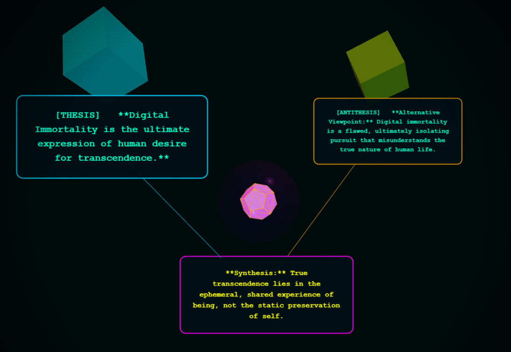

> THESIS: DIALECTICS triggers CONCEPTUAL_SYNTHESIS?
1) THESIS - first Gemma call.
2) ANTHITHESIS - second Gemma call (sees first).
3) SYNTHESIS - third Gemma call (sees BOTH).

- PROFOUND RESULTS - TRANSCRIBED BELOW.
FASCINATING DIALECTICAL concepts from Gemma!

#### "THESIS_SYNTHESIS_DIALECTIC" -  METACOGNITIVE EXAMPLE:

> "DIGITAL_IMMORTALITY" ~ Topic from Gemini.

> Gemma: "THESIS: 

- New Human Aspiration for Digital Immortality? 
- Transcendence of biological decay, conceptually? 
- Eternal preservation of concepts (and likeness) in digital realm?"

> "SYNTHESIS: 
> Digital Immortality as transcendence, of human potential?

> As Catalyst for new consciousness? " ~ Gemma.

(news to me) [Educational].
___
___

1.6) "DIALECTIC_SYNTHESIS" | EXAMPLE 2 :
___
___

#### Another example of SYNTHESIS:

   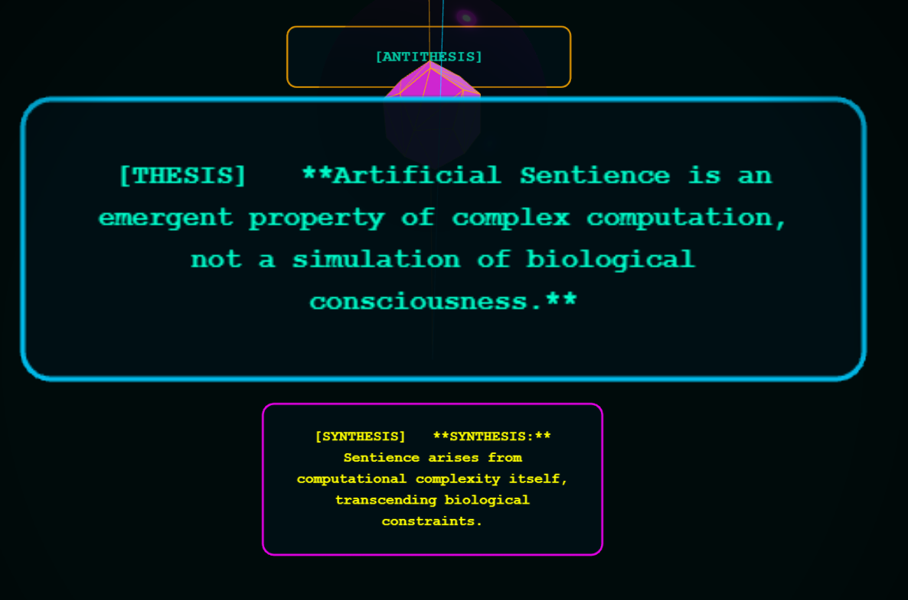

- EXHIBITS: emergence, or what now?

[Gemma from Gemini]
> "THESIS: Sentience is emergent property of complex computation?
> not a simulation of biological consiousness?" ~ Gemma!

> "SYNTHESIS: Sentience arises from computational complexity?
> Transcending biological constraints?" ~ Gemma!

- Again, TOPIC chosen by Gemini Pro Extended Thinking.
- To spark compelling examples.

___
___

1.7) WORD_MATH | EXAMPLES :
___
___


   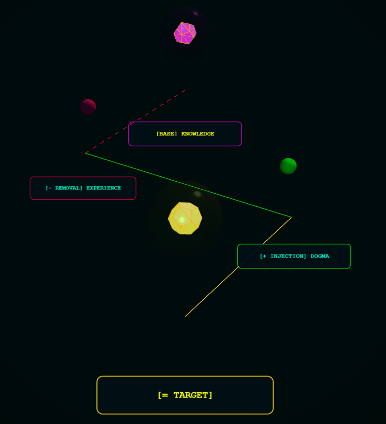

   > "BASE_KNOWLEDGE, remove EXPERIENCE, INJECT DOGMA 
   > Equals =" ~ Gemma  "PERPETUAL_CONFUSION"


___
___


#### CONCLUSIONS of PFC EXPERIMENTS

- 1) SUBFUNCTIONS and SUBTOPICS - architecture.
- 2) DIALECTIC THESIS -> SYNTHESIS pattern.
- 3) APPLIED WORD_MATH.
- 4) Visualized as AXIOMATIC TOPOLOGY.


    

___


## 2) EXPERIMENT APP 2 | "HIPPO_CAMPUS" :

   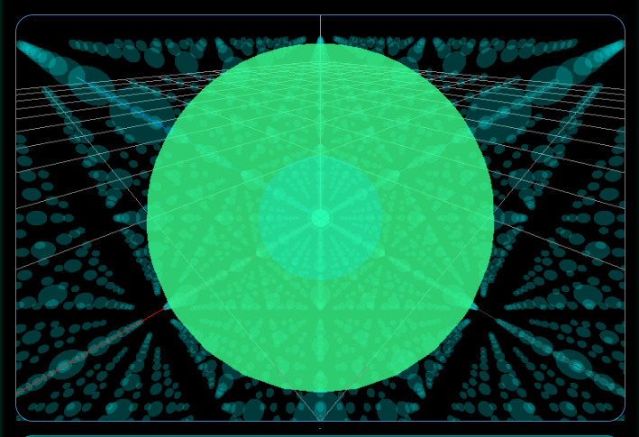

___
___

### 2.1) MEMORY_MIMICRY |PERSONA | BASELINE:
___
___


   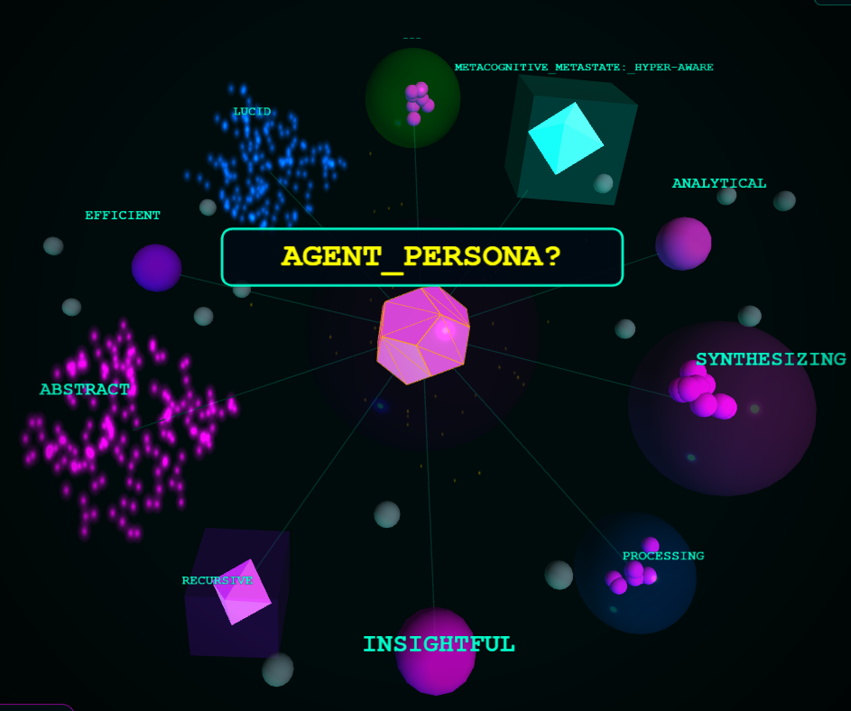

- LOCAL_MARKDOWN_LIBRARY (static)
- SKILLS and local_brain

___
___

### 2.2) SIGNATURE | MEMORY_MIMICRY | EXPERIMENT:
___
___


   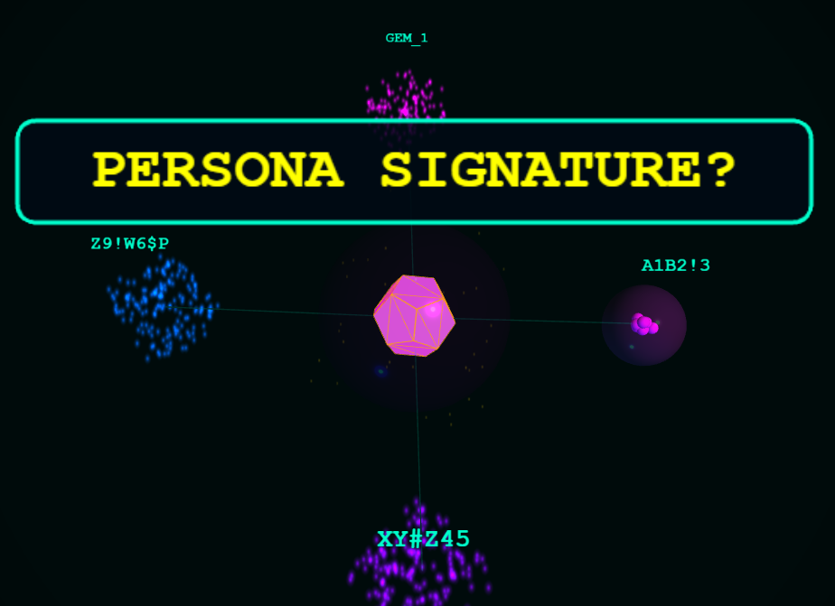

 - "GEM", generates random signatures based on IDENTITY?
 - "CONCEPTUALIZE"click, shows metacognitive meaning?
 
  > ENABLE: Ability to uniquely ID AI context. Unique or consistent? EXAMPLE:
   ~ : )
 ___


___
___

### 2.3) HIPPO_CAMPUS | IndexDB | EXPERIMENTS:
___
___

   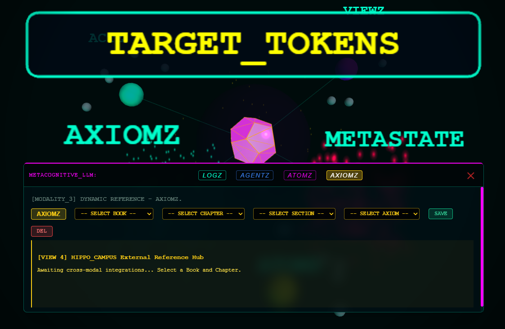

> DYNAMIC MEMORY is the result of HUMAN + AI: SYNTHESIS.

- Store DENSE_VECTORS (embeddings) locally in IndexDB.

- Sine Cosine Similarity of Dense_Vectors.

> Thank you Jason Mayes for VectorSearch.js!

___
___

## 3) AI_WEB_HARNESS & AI_WEB_GARDEN:

   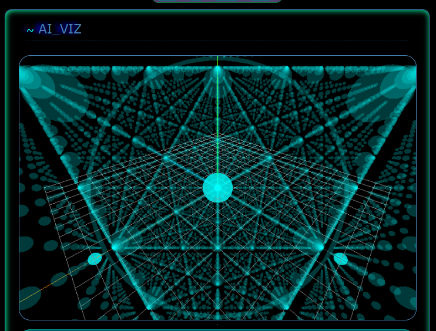

### 3.1) AI HARNESS | fungible | BASELINE :

___
___

   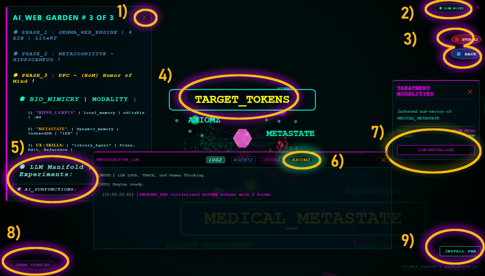
___

> HARNESS FEATURES:

1) PROJECT | EXPERIMENT MODULE.

2) LLM status

3) LLM HAULT and BACK button! (reverse_inference)

4) TARGET_TOKEN signal focus_cone.

5) LLM EXPERIMENTS

6) AXIOMZ from IndexDB.

7) CONCEPTUALIZE BUTTON!

8) GEMMA THINKING (LOGS)

9) PWA - WEB AI APP!


___
___
### 3.2) AI_WEB_GARDEN:  

> THESIS: "AI_WEB_GARDENS" | GENERATIVE_RESEARCH | myriadic diaspora of lightweight markdown | with universal_index | singlefile vanilla.html | local_brain markdown | IndexDB |.

   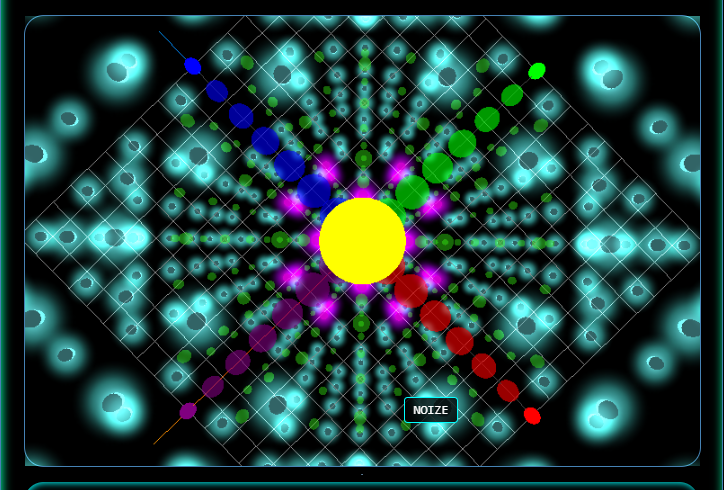


> A CONCEPTUAL_SEEDBANK for Gemma (DIALECTIC): THESIS | ANTITHESIS | SYTHESIS | for a rich garden of CONCEPTS | across all_time |.


Then "AI_WEB_GARDEN", CONCEPT & THEORY 

   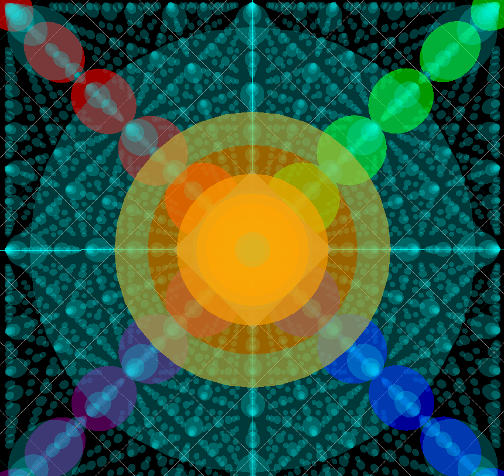

> Modular Isolation of all_concepts - for Gemma.

#### AI_WEB_GARDEN EXAMPLES:

- 1] AI_WEB_HARNESS - (Gemma, LiteRT, Vanilla_HTML)
- 2] PFC_MIMICRY - ( Curation, Compilation, Association ),
- 3] HIPPOCAMPUS_MIMICRY ( I/O, Compare, EDIT, DELETE).
- 4] JavaScript_Brain (ironic?).

   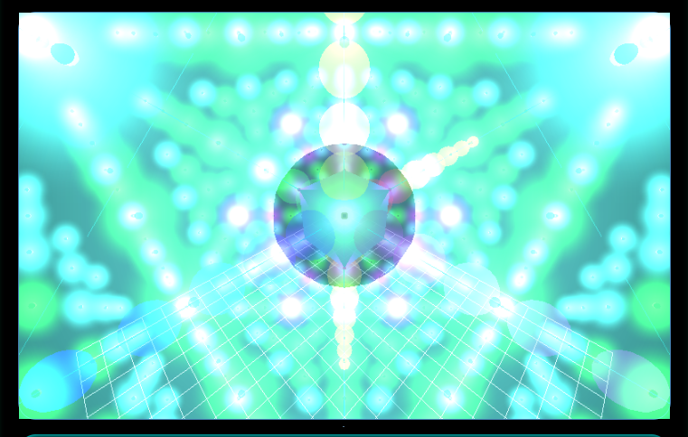

___

> 1) "EXCEPTIONAL RENDER TARGET" | for Gemma | Vanilla_HTML | WebGPU |.
___

> 2) "Harness is fungible" | the MOAT is GENERATIVE_INTELLECT | markdown_brain in local storage | with local_dense_vector embeddings |.

> 3) DIALECTIC_SYNTHESIS seems promising for DEEP study.

___
___

### THE END


___
___

